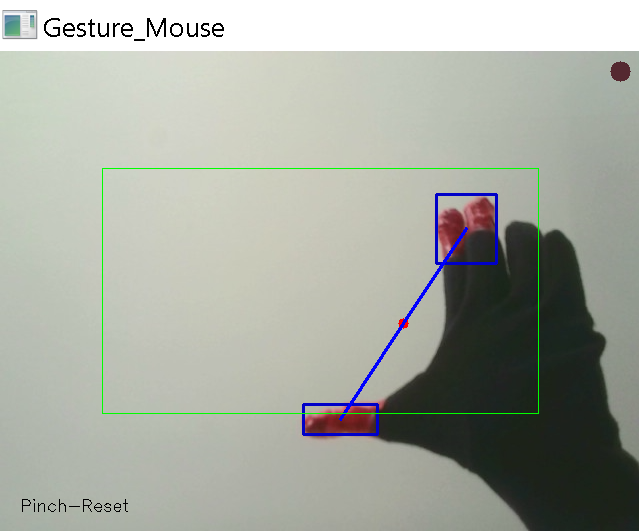
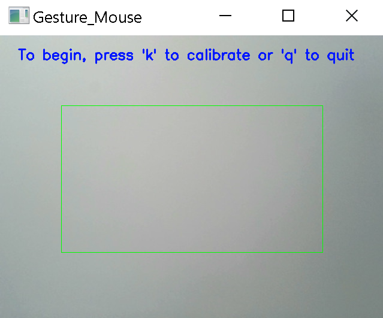
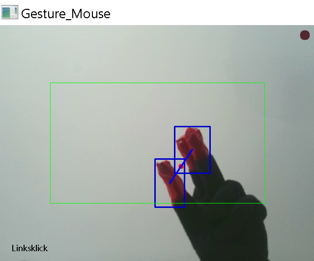
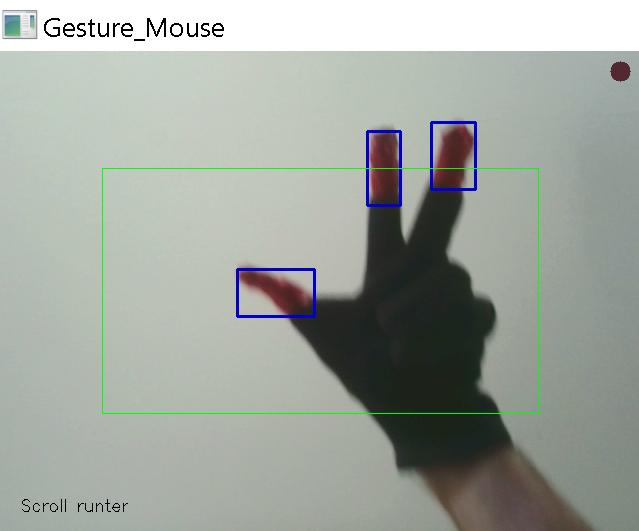

# 👆 Gesture Mouse – Markerbasierte Maussteuerung per Webcam  

Team Hufflepuff (David Ring & Marc Flöter), Universität Regensburg, Interaktionstechniken und -technologien (SoSe2025)



---

## Allgemein

Ziel des Assignments war, ein interessantes Interaktionssystem aus einer wissenschaftlichen Veröffentlichung nachzubauen. Im Rahmen dieser Abgabe wurde ein `Gesture Mouse` entwickelt, ein kamerabasiertes System, welches Nutzern erlaubt, mit farbigen Markern an den Fingerspitzen verschiedene Mausaktionen durchzuführen. Via Finger-Gesten vor einer Webcam ermöglicht die Anwendung Mausbewegung, Links- und Rechtsklick, Doppel-Linksklick sowie vertikales Scrollen – ausschließlich durch Gesten mit drei farbig markierten Fingern.

Diese Anwendung basiert auf dem Paper `"Design and Development of Hand Gesture Based
Virtual Mouse" von Shibly et al. (ICASERT 2019)`. Die hier implementierte Version orientiert sich eng an den im Paper beschriebenen Interaktionen, wurde jedoch in Python umgesetzt und um zusätzliche Funktionen wie Farbkalibrierung, Beschränkung des Aktionsbereiches, On-Screen-Logging und Soundeffekte erweitert. Das Audiofeedback wurde generiert mit https://ttsmp3.com/ai.

---

## Benutzung

### Anforderungen

#### Hardware
- Webcam
- Drei farbige Marker an Zeigefinger, Mittelfinger und Daumen (z.B. rote Fingerkappen oder farbige Aufkleber)
- Möglichst neutraler Hintergrund

#### Software
Alle notwendigen Pakete sind in `requirements.txt` aufgelistet und können von dort installiert werden.

##### Externe Bibliotheken:
- `cv2` (OpenCV): Bildverarbeitung, Kamera, Konturenerkennung
- `numpy`: Array-Berechnungen, Schwellenwertvergleiche
- `pynput`: Steuerung der Maus
- `pyautogui`: Ermittlung der Bildschirmgröße
- `pygame`: Soundeffekte

---

### Start und Kalibrierung

Die Anwendung wird direkt über das Hauptskript gestartet:

```bash
python gesture_mouse.py
```


Per Commandline Argument können folgende Einstellungen beim Start festgelegt werden:
- `-v <ID>` setzt die Geräte-ID der zu verwendenden Webcam fest (default: 0)
- `-s <0/1>` Soundausgabe aktiv (1) oder inaktiv (0) (default: 1)

```bash
python gesture_mouse.py -v 0 -s 0
```



Beim Programmstart wird der Nutzer zunächst Aufgefordert, die Farbe der zu erkennenden Marker zu kalibrieren. Sobald der Nutzer `k` drückt, muss ein Marker einige Sekunden ruhig im Zentrum des Kamerabildes gehalten werden. Die erkannte Farbe wird als Zusatzinformation in einer Bildschirmecke angezeigt. Nun kann der Nutzer die Steuerung seines Desktop-Mauszeigers per Finger-Gestiken beginnen.


---

### Ansicht und Bedienung

Die Anwendung zeigt standardmäßig das Kamerabild der Webcam. Ein grüner Rahmen markiert den Bereich, der zur Steuerung des Mauscursors aktiv ist. Unten links wird (je nach Einstellung) angezeigt, welche Geste gerade erkannt wird.
Wird ein Marker erkannt, erscheint um ihn in blau seine Bounding-Box (Anzeige einstellbar!). Wenn mehrere Marker erkannt werden, werden deren Mittelpunkte mit einer blauen Linie verbunden. Werden genau zwei Marker erkannt, erscheint mittig zwischen diesen ein roter Punkt, der den Mauscursor steuert.

#### Steuerungsgesten

| Geste                  | Aktion                      |
|------------------------|-----------------------------|
| **2 Marker, offen**    | Cursorbewegung (Mitte der beiden Marker)              |
| **2 Marker, zueinander führen (Pinch)** | Linksklick |
| **Pinch halten (5 s)** | Doppel-Linksklick                 |
| **1 Marker sichtbar**  | Rechtsklick                 |
| **3 Marker, vertikale Bewegung** | Scrollen       |






#### Weitere Steuerung

- `q` beendet die Anwendung
- `k` startet die Kalibrierung erneut

---

### Einstellungen

Die wichtigsten Parameter lassen sich direkt oben im Code anpassen:

#### Anzeigeoptionen
- `SHOW_CAM`: Kamerabild anzeigen
- `SHOW_BORDER`: Aktiven Tracking-Bereich für Mauscursorbewegung anzeigen
- `SHOW_BOUNDING_BOXES`: Rechtecke um erkannte Marker und Linien zwischen ihren Mittelpunkten anzeigen
- `SHOW_LOG`: Log-Overlay mit Statusmeldungen anzeigen

#### Marker- und Gestenerkennung
- `MIN_MARKER_SIZE`: Mindestgröße einer Fläche der kalibrierten Farbe, um als Marker erkannt zu werden (default: 500 p)
- `BORDER_RATIO`: Abstand des Mauscursor-Trackingbereichs zum Rand (in % der Frameseitenlängen, default: 0.1)
- `PINCH_CLICK_RATIO`: Verhältnis für Linksklickauslösung (default: 0.20)
- `PINCH_RESET_RATIO`: Verhältnis für Linksklick-Ende (default: 0.35)
- `DOUBLE_CLICK_HOLD_TIME`: Haltezeit für Doppel-Linksklick (default: 5 s)
- `MIN_Y_DIST_FOR_SCROLL`: Minimale y-Bewegung für Auslösen der Scroll-Geste (default: 10 p)
- `FRAMES_REQUIRED_FOR_RIGHT_CLICK`: Dauer bis Rechtsklick bei 1 Marker


#### Kalibrierung
- `HSV_TOLERANCE`: Hue-Farbtoleranzbereich um den kalibrierten Farbwert herum
- `CALIBRATION_TIME`: Dauer für Marker-Kalibrierung

Zudem können GUI-Designoptionen (Farben, Strichdicken etc.) per Konstante angepasst werden.

---
## Auswahl des Papers

### Literatursuche

Wir haben viele aktuelle und ältere Wissenschaftliche Veröffentlichungen in Bedachte gezogen, bevor wir uns für das Paper `"Design and Development of Hand Gesture Based Virtual Mouse" von Shibly et al. (ICASERT 2019)` entschieden haben. Die Idee, den Desktop-Mauszeiger auf irgendeine Art und Weise über alternative Wege zu steuern klang für uns relevant, zu den bisherigen Kursinhalten passend und realistisch in 2 Wochen kostengünstig umzusetzen. Hierzu haben wir auch mehrere relevante Veröffentlichungen gefunden:

   - `Agrawal, Sandip, et al. "Using mobile phones to write in air." Proceedings of the 9th international conference on Mobile systems, applications, and services (2011)` : Steuerung der Desktop-Maus über Handy-Accelerometer/Gyrometer-Daten wäre durchaus denkbar, und die Umsetzung über DIPPID wäre bekannt gewesen. Dies wäre kombinierbar gewesen mit dem Ansatz aus dem Paper `Ruiz, Jaime, and Yang Li. "DoubleFlip: a motion gesture delimiter for mobile interaction." Proceedings of the SIGCHI Conference on Human Factors in Computing Systems (2011)`, welcher durch Gestiken wie Double-Flip des Smartphones bestimmte Aktionen triggern kann. Dieser kombinierte Ansatz könnte z. B. eine Bluetoothmaus ersetzen, mit dem Vorteil dass Leute ihr Handy fast immer bei sich haben. Nachteil an dem Ansatz ist, dass man sein Handy vielleicht eigentlich gerade für etwas anderes (z. B. gleichzeitige Videokonferenz) nutzen möchte. 

   - `Wang, Jingtao, Shumin Zhai, and John Canny. "Camera phone based motion sensing: interaction techniques, applications and performance study." Proceedings of the 19th annual ACM symposium on User interface software and technology. 2006.` : In diesem relativ alten Paper wurde `tinyMotion`entwickelt, eine Anwendung die per Kamera-Bild-Auswertung die Bewegung der Kamera tracken kann. Das klang auch nach einer interessanten Idee für manche Anwendungszwecke, ist aber heutzutage mit Sensoren vermutlich genauer umsetzbar. Dennoch wäre es eine denkbare Methode gewesen, einfache Maus-Bewegungen durch bewegen der Webcam zu steuern.

   - `Gupta, Sidhant, et al. "Soundwave: using the doppler effect to sense gestures." Proceedings of the SIGCHI Conference on Human Factors in Computing Systems. 2012.`: Mit Niedrigfrequenztönen und dem Doppler-Effekt konnten Gestiken erkannt werden. In dem Paper werden verschiedene Gestiken wie Scroll und Rotation mit 1-2 Händen vor dem Laptop robust in echtzeit ausgeführt. Das Prinzip dahinter fanden wir sehr clever, und man konnte damit sogar Tetris spielen, wie in ihrem Demo-Video zu sehen ist. Allerdings sind die Gestiken relativ groß und möglicherweise anstrengend über längere Zeit durchzuführen. Zusätzlich ist das benutzen beider Händle gleichzeitig relativ umständlich, verglichen mit Lösungen die nur die Fingerspitzen bewegen. Eine ähnliche Sound-Basierte Lösung via Sonar wurde auch von `Nandakumar, R., Iyer, V., Tan, D., & Gollakota, S. (2016, May). Fingerio: Using active sonar for fine-grained finger tracking. In Proceedings of the 2016 CHI Conference on Human Factors in Computing Systems (pp. 1515-1525).` benutzt, welche die Finger via Echo-Effekte genau tracken konnte. Der Vorteil solch eines Systems ist, dass keine Direkte Sichtlinie benötigt wird, da der Ton auch aus versteckten Stellen heraus erkannt werden kann. Dies hätte keine spezielle Hardware außer einem Laptop benötigt, allerdings waren wir uns unsicher, wie gut wir die Software implementieren können, und befürchteten, dieser Audio-Basierte Input könnten schwer zu debuggen sein.

### Entscheidung

Aus diesem Pool verschiedener interessanter Interaktionstechniken haben wir uns letztlich für `"Design and Development of Hand Gesture Based Virtual Mouse" von Shibly et al. (ICASERT 2019)` entschieden. Gefallen an der Lösung hat uns, dass sie einen vollwertiger Maus-Ersatz darstellt mit allen wichtigen Funktionen.

Ein weiterer positiver Aspekt am Paper ist, dass die Programmstruktur & Gesten genau erklärt und mit Bildern dokumentiert sind. An manchen Stellen hätten wir uns allerdings noch eine etwas genauere Erklärung gewünscht, beispielsweise zwecks den Erklärungen über Implementierung und Designentscheidung hinsichtlich den Gesten für Links-, Rechts- und Doppelklick.

 Auch die Erkennungsquoten der einzelnen Gestem im Paper waren mit durchschnittlich ca. 90% (vor weißem Hintergrund) relativ gut, was vielversprechend wirkte. Zusätzlich fanden wir es praktisch, dass als Materialaufwand lediglich etwas farbiger Tesa-Film und ggf. ein Handschuh, an dem man den Tesa festkleben kann, benötigt wird.

 Wir waren zuversichtlich, dass die Coding-Herausforderungen dieses Projektes unseren im Kurs erworbenen Kenntnissen entsprechen würde. Zudem ist diese Art von Anwendung leicht visuell zu debuggen, was bei der Entwicklung geholfen hat.

 Auch die potentiellen Anwendungszwecke der Gesture-Mouse fanden wir interessant. Neben dem Steuern von Computern nennt das Paper auch das Steuern von Robotern als potentiellen Anwendungszweck, oder als Steuerung in VR-Umgebungen, in denen man die Hände frei haben will. Auch für Menschen, die ihre Gliedmaßen nicht oder schlecht bewegen können, könnte das System hilfreich sein.

Abschließend lässt sich sagen, dass das vorgeschlagene Interaktionssystem des Papers viel Potential bietet. Wir haben an manchen Stellen noch Erweiterungspotential und Quality-Of-Life improvements implementiert, wie eine automatische Kalibrierung, eine Puffer-Border um das Anwendungsfenster und Audio-Feedback.

---

## Designentscheidungen und Funktionsweise

### 1. Marker-Tracking & Kalibrierung

Wie im Referenzpaper erfolgt die Gestenerkennung Anhand des Verhältnisses und der Bewegung von drei gleichfarbigen Markern an Zeigefinger, Mittelfinger und Daumen. Anders als im Paper, wo eine von 5 Farben ausgewählt werden musste, wurde dieser Ansatz von uns durch die Möglichkeit, die zu erkennende Markerfarbe dynamisch zu kalibrieren, verbessert. Dies erhöht auch die Erkennungsquote bei verschiedenen Lichtverhältnissen.

- Farbbasierte Markerkennung mittels OpenCV im HSV-Farbraum.
- Die Kalibrierung der Markerfarbe erfolgt manuell über die Taste `k`: Ein durchschnittlicher Farbwert wird über 3 Sekunden (einstellbar) aus dem markierten Zentrum des Bildes bestimmt und rechts oben angezeigt. Anfangs wird ein Text als Hinweis auf die notwendige Kalibrierung angezeigt und vorgelesen.
- Je nach Anzahl und Dauer gleichzeitig erkannter, valider Konturen (richtige Farbe und Größe) werden verschiedene Gesten erkannt und entsprechende Aktionen ausgeführt.

### 2. Steuerung der Mausposition

Die Geste und ihre Anzeige (Roter Mittelpunkt zwischen zwei erkannten Markern = Mausposition, Anzeige von Bounding-Boxen und ihren Verbindungslinien) wurde direkt aus dem Referenzpaper genommen. Ergänzt wurde eine Einschränkung des Tracking-Bereichs, damit auch die äußersten Ecken des Bildschirms sicher angesteuert werden können.

- Berechnung eines Mauscursor-Trackingbereichs (grüner Kasten) zum Anwendungsstart, der das Seitenverhältnis des Bildschirms abbildet. Seine Größe richtet sich nach einem prozentual zur Seitenlänge definierten Abstand zum Fensterrand (einstellbar).
- Durch Minimale Blob-Größen und morphologischen Operationen werden die Fingerspitzen sehr gut erkannt. Gute Lichtverhältnisse sind je nach Webcam-Qualität trotzdem vorteilhaft.
- Die Mausposition wird dynamisch von Markerkoordinaten auf Bildschirmkoordinaten gemappt. Dabei wird sichergestellt, dass die Bewegung nicht verzerrt wird.
- Clipping verhindert Ausreißer über den Bildschirmrand hinaus.

### 3. Klick- und Scroll-Gesten

Die Gesten, ihre Funktionsweisen und Anzeige (Anzeige von Bounding-Boxen und ihren Verbindungslinien) wurden direkt aus dem Referenzpaper entnommen, wenn auch als suboptimal erachtet (siehe Limitationen und Ergebnisse des Referenzpapers). Für den Rechtsklick wurde eine Mindestanzahl zu haltenden Frames eingeführt. Sie verhindert ständige, ungewollte Rechtsklicks durch flackern bei schlechter Markererkennung. Eine Anzeige der derzeit erkannten Geste als Text unten links inkl. Logging und Sprachausgabe wurde ergänzt (einstellbar).

- **Rechtsklick**: Ein einzelner Marker bleibt länger als 8 Frames (einstellbar) im Bild. 
- **Linksklick**: Zwei Marker werden zusammengeführt ("Pinch") (Gemeinsame Bounding Box <= 20 % der Startfläche, einstellbar).
- **Doppel-Linksklick**: Der Pinch wird länger als 5 Sekunden (einstellbar) gehalten
- **Scroll**: Drei Marker bewegen sich sichtbar nach oben oder unten (Vergleich des durchschnittlichen y-Werts mit Vorwert, nötige Differenz einstellbar).

Ausgeführt werden die Gesten per `pynput`, um echte Maus-Eingaben auf dem Desktop tätigen zu können.

---

## Limitationen

- Die Farberkennung kann bei schlechten Lichtverhältnissen oder reflektierenden Oberflächen unzuverlässig sein.
- Gegenstände oder Hintergründe in Markerfarbe machen das System unbenutzbar (bei rot z.B. sogar Lippen).
- Ab einer gewissen Nähe werden zwei Marker als eine Fläche erkannt -> Rechtsklick statt Linksklick.
- Inkonsistente Erkennung kann dazu führen, dass ungewollt Rechtsklicke ausgeführt werden (Designentscheidung des originalen Papers).

---

## Verbesserungsvorschläge

Die Anwendung funktioniert relativ zuverlässig, allerdings würden wir Rückblickend ein paar Design-Entscheidungen, welche wir aus dem Paper übernommen haben, überdenken:

- Rechtsklick mit komplexerer Geste, um versehentlich ausgelöste Gesten zu verringern.
- Möglicherweise wäre die Linksklick-Geste weniger verwechselbar als Ein-Marker-Geste
- Entweder 4 statt 3 Marker, oder eine Zweite Farbe, z. B. auf dem Handrücken, könnte für seltene Operationen praktisch sein